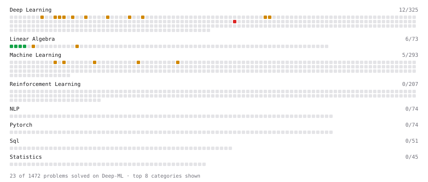

# Deep-ML

My machine learning practice from [Deep-ML](https://www.deep-ml.com). Every solution here was written by hand.

**21** solved · 21 problems · 0 labs · 0 math

[**Browse the interactive portfolio**](https://jasminesekhonm.github.io/deep-ml/) to replay this filling in over time.

## Problems

| | Difficulty | Solved | |
| --- | --- | --- | --- |
| [Calculate Mean by Row or Column](https://www.deep-ml.com/problems/4) | easy | 2026-09-19 | [solution](problems/0004-calculate-mean-by-row-or-column) |
| [Matrix-Vector Dot Product](https://www.deep-ml.com/problems/1) | easy | 2026-09-19 | [solution](problems/0001-matrix-vector-dot-product) |
| [Reshape Matrix](https://www.deep-ml.com/problems/3) | easy | 2026-09-19 | [solution](problems/0003-reshape-matrix) |
| [Transpose of a Matrix](https://www.deep-ml.com/problems/2) | easy | 2026-09-19 | [solution](problems/0002-transpose-of-a-matrix) |
| [Adam Optimizer](https://www.deep-ml.com/problems/87) | medium | 2026-09-25 | [solution](problems/0087-adam-optimizer) |
| [Calculate Correlation Matrix](https://www.deep-ml.com/problems/37) | medium | 2026-09-26 | [solution](problems/0037-calculate-correlation-matrix) |
| [Calculate Eigenvalues of a Matrix](https://www.deep-ml.com/problems/6) | medium | 2026-09-19 | [solution](problems/0006-calculate-eigenvalues-of-a-matrix) |
| [Calculate Performance Metrics for a Classification Model](https://www.deep-ml.com/problems/77) | medium | 2026-09-25 | [solution](problems/0077-calculate-performance-metrics-for-a-classification-model) |
| [Divide Dataset Based on Feature Threshold](https://www.deep-ml.com/problems/31) | medium | 2026-09-27 | [solution](problems/0031-divide-dataset-based-on-feature-threshold) |
| [Generate Random Subsets of a Dataset](https://www.deep-ml.com/problems/33) | medium | 2026-09-27 | [solution](problems/0033-generate-random-subsets-of-a-dataset) |
| [Implement Adam Optimization Algorithm](https://www.deep-ml.com/problems/49) | medium | 2026-09-25 | [solution](problems/0049-implement-adam-optimization-algorithm) |
| [Implement Batch Normalization for BCHW Input](https://www.deep-ml.com/problems/115) | medium | 2026-09-28 | [solution](problems/0115-implement-batch-normalization-for-bchw-input) |
| [Implement Gradient Descent Variants with MSE Loss](https://www.deep-ml.com/problems/47) | medium | 2026-09-22 | [solution](problems/0047-implement-gradient-descent-variants-with-mse-loss) |
| [Implement Layer Normalization for Sequence Data](https://www.deep-ml.com/problems/109) | medium | 2026-09-27 | [solution](problems/0109-implement-layer-normalization-for-sequence-data) |
| [Implement Long Short-Term Memory (LSTM) Network](https://www.deep-ml.com/problems/59) | medium | 2026-09-28 | [solution](problems/0059-implement-long-short-term-memory-lstm-network) |
| [Implement Masked Self-Attention](https://www.deep-ml.com/problems/107) | medium | 2026-09-28 | [solution](problems/0107-implement-masked-self-attention) |
| [Implement PReLU Forward and Backward Pass](https://www.deep-ml.com/problems/98) | medium | 2026-09-28 | [solution](problems/0098-implement-prelu-forward-and-backward-pass) |
| [Implement Self-Attention Mechanism](https://www.deep-ml.com/problems/53) | medium | 2026-09-28 | [solution](problems/0053-implement-self-attention-mechanism) |
| [Implementing a Simple RNN](https://www.deep-ml.com/problems/54) | medium | 2026-09-25 | [solution](problems/0054-implementing-a-simple-rnn) |
| [LoRA: Low-Rank Adaptation Forward Pass](https://www.deep-ml.com/problems/222) | medium | 2026-09-28 | [solution](problems/0222-lora-low-rank-adaptation-forward-pass) |
| [Simple Convolutional 2D Layer](https://www.deep-ml.com/problems/41) | medium | 2026-09-22 | [solution](problems/0041-simple-convolutional-2d-layer) |

---

_This file is regenerated by Deep-ML on every push._
